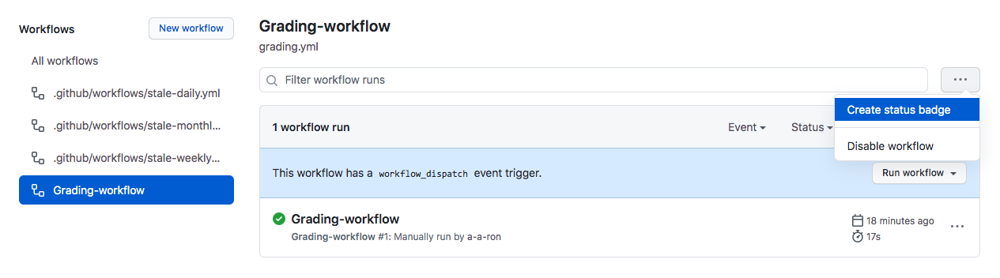

# Workflows

## Table of Contents
- [The Components](#the-components)
  - [Workflows](#workflows)
  - [Jobs](#jobs)
  - [Steps]($steps)
  - [Actions](#actions)
- [Creating a Workflow](#creating-a-workflow)
- [Configuring a Workflow](#configuring-a-workflow)
  - [Configuring workflows to run on a schedule](#configure-workflows-to-run-on-a-schedule)
  - [Configuring workflows to run for manual events](#configuring-workflows-to-run-for-manual-events)
  - [Configuring workflows to run for webhook events](#configuring-workflows-to-run-for-webhook-events)
  - [Workflow permissions](#workflow-permissions)
  - [Configuring the workflow to run across multiple OS/Language Versions](#configuring-the-workflow-to-run-across-multiple-oslanguage-versions)
- [Use conditional keywords](#use-conditional-keywords)
- [Environment Variables and Contexts](#environment-variables-and-contexts)
- [Scripts](#scripts)
- [Caching with the Cache Action](#caching-with-the-cache-action)
- [Artifacts](#artifacts)
  - [Storing Artifacts](#storing-artifacts)
  - [Downloading Artifacts](#downloading-artifacts)
- [Accessing Workflow Logs](#acessing-workflow-logs)
  - [Using the REST API](#using-the-rest-api)
- [Disable and Delete Workflows](#disable-and-delete-workflows)
- [Configuring an Action](#configuring-an-action)
  - [Use specific versions of an action](#use-specific-versions-of-an-action)

## The Components


In short, an event triggers a **workflow** which contains a **job**. The job then uses **steps** to dictate which **actions** wull run within the workfow.

### Workflows

A workflow is an automated process that you add to your repository. A workflow needs at least *one* job, and different events can trigger it. It can be used to build, test, package, release, or deploy a project.

### Jobs

The job is the first major component within a workflow. A job is a section of the workflow that will be associated with a runner. A job can run on a machine or in a container. You'll specify the runner with the `runs-on` attribute.

### Steps
A step is an individual task that you can run commands in a job.

### Actions
The actions insde a workflow are the standalone commands that are executed. These standalone commands can reference Github Actions such as using your own custom actions, or community actions. You can also run commands such as `run: npm install -g bats` to execute a command on the runner.

## Creating a Workflow

To create a workflow, start by adding a new `.yml` file in the `.github/workflows` directory of your repository. Below is an example of a workflow:

```yml
name: A workflow for my Hello World file # The name that will apear in the Actions tab of a repo
on: push
jobs:
  build:
    name: Hello world action
    runs-on: ubuntu-latest
    steps:
    - uses: actions/checkout@v1
    - uses: ./action-a
      with:
        MY_NAME: "Mona"
```

## Configuring a Workflow

Below are a few common configurations of a workflow file as well as some different ways to configure a workflow and best practices.

### Configure workflows to run on events

The `on` attribute specifies what will trigger this workflow to run. Here, it triggers whenever there's a push event to the repository. You can specify single events like `on:push`, an array of events like `on: [push, pull_request]`, or an event-configuration map that schedules a workflow or restricts the execution of a workflow to specific files, tags, or branch changes:

```yml
on:
  # Trigger the workflow on push or pull request,
  # but only for the main branch
  push:
    branches:
      - main
  pull_request:
    branches:
      - main
  # Also trigger on page_build, as well as release created events
  page_build:
  release:
    types: # This configuration doesn't affect the page_build event above
      - created
```

[A full list of triggerable events is listed here.](https://docs.github.com/actions/using-workflows/events-that-trigger-workflows)


### Configure workflows to run on a schedule

The `schedule` event allows you to trigger a workflow to run at specific UTC times using POSIX cron syntax. For example, if you want to run a workflow every 15 minutes:

```yml
on:
  schedule:
    - cron: '*/15 * * * *'
```
If you want a workflow to run every sunday at 3:00am:
```yml
on:
  schedule:
    - cron: '0 3 * * SUN'
```
The shortest interval you can run scheduled workflows is once every 5 minutes, and they run on the latest commit on the default or base branch.

### Configuring workflows to run for manual events

You can manually trigger a workflow by using the `workflow_dispatch` event. This event allows you to run the workflow by using the Github REST API or by selecting the **Run workflow** button in the **Actions** tab within a repository. Using `workflow_dispatch`, you can choose on which branch you want the workflow to run, as well as set optional `inputs` that Github will present as form elements in the UI:

```yml
on:
  workflow_dispatch:
    inputs:
      logLevel:
        description: 'Log level'     
        required: true
        default: 'warning'
      tags:
        description: 'Test scenario tags'  
```

In addition to `workflow_disptach`, you can use the Github API to trigger a webhook event called `repository_dispatch`. This event allows you to trigger a workflow for activity that occurs outside of Github. It essentially serves as an HTTP request to your repository asking Github to trigger a workflow off an action or webhook. Using this manual event requires you to do two things: send a `POST` request to the GitHub endpoint `/repos/{owner}/{repo}/dispatches` with the webhook event names in the request body, and configure your workflow to use the `repository_dispatch` event:

```bash
curl \
  -X POST \
  -H "Accept: application/vnd.github.v3+json" \
  https://api.github.com/repos/octocat/hello-world/dispatches \
  -d '{"event_type":"event_type"}'
```
```yml
on:
  repository_dispatch:
    types: [opened, deleted]
```

### Configuring workflows to run for webhook events
Lastly, you can trigger a workflow to run when specific webhook events occur on Github. YOu can trigger most webhook events from more than one activity for a webook. If multiple activities exist for a webhook, you can specify an activity type to trigger the workflow. For example, you can run a workflow for the `check_run` event, but only for the `rerequested` or `requested_action` activity types:

```yml
on:
  check_run:
    types: [rerequested, requested_action]
```

### Workflow permissions

You can give your workflow permissions to operate on the repository. Consider the example below:

```yml
name: Post welcome comment
on:
  pull_request:
    types: [opened]
permissions:
  pull-requests: write
```

### Configuring the workflow to run across multiple OS/language versions

To run a worflow against different operating systems or different versions of a language, you need to configure a build matrix:

```yml
strategy:
  matrix:
    os: [ubuntu-latest, windows-latest]
    node-version: [16.x, 18.x]
```

A matrix defined like this will produce four builds, one for each OS/language version pair. Sorting through four different builds for errors can be difficult, so it is recommened to test in a dedicated job. Separating the build and test steps makes it easier to understand the logs:

```yml
test:
  runs-on: ${{ matrix.os }}
  strategy:
    matrix:
      os: [ubuntu-latest, windows-latest]
      node-version: [16.x, 18.x]
  steps:
  - uses: actions/checkout@v3
  - name: Use Node.js ${{ matrix.node-version }}
    uses: actions/setup-node@v3
    with:
      node-version: ${{ matrix.node-version }}
  - name: npm install, and test
    run: |
      npm install
      npm test
    env:
      CI: true
```

This gives the workflow permission to write to pull requests.

## Use conditional keywords
Within a workflow file, you can access context information and evaluate expressions. Expressions are communly used with the conditional `if` keyword in a workflow file to determine whether a step should run or not. You can also use any supported context and expression to create a conditional. It's important to know that when using conditionals in a workflow, you need to use the specific syntax `${{ <expression> }}. 

For example, a workflow uses the `if` conditional to check if the `github.ref` (the branch or tag ref that triggered the workflow run) matches `refs/head/main`:

```yml
name: CI
on: push
jobs:
  prod-check:
    if: github.ref == 'refs/heads/main'
    runs-on: ubuntu-latest
    steps:
      ...
```

Notice that in this example, the `${{ }}` are missing from the syntax. With some expressions, as in the case of the `if` conditional, you can omit the expression syntax. Github automatically evaluates some of these common expressions, but you can always include them in case you forget which expressions Github automatically evaluates.

## Environment Variables and Contexts

Within the GitHub Actions workflow, there are several default environment variables that are available for you to use, but only within the runner that's executing a job. In addition to default environment variables, you can use defined variables as contexts. Contexts and default variables are similar in that they both provide access to environment information, but they have some important differences. While default environment variables can only be used within the runner, context variables can be used at any point within the workflow. For example, context variables allow you to run an if statement to evaluate an expression before the runner is executed:

```yml
name: CI
on: push
jobs:
  prod-check:
    if: github.ref == 'refs/heads/main'
    runs-on: ubuntu-latest
    steps:
      - run: echo "Deploying to production server on branch $GITHUB_REF"
```

Similar to using default environment variables, you can use custom environment variables in your workflow file. To create a custom variable, you need to define it in your workflow file using the `env` context. If you want to use the value of an environment variable inside a runner, you can use the runner operating system's normal method for reading environment variables.

```yml
name: CI
on: push
jobs:
  prod-check:
    if: github.ref == 'refs/heads/main'
    runs-on: ubuntu-latest
    steps:
      - run: echo "Nice work, $First_Name. Deploying to production server on branch $GITHUB_REF"
        env:
          First_Name: Mona
```

## Scripts

The `run` keyword is used to tell the job to execute a command on the runner. For example, you can install NPM dependencies:

```yml
jobs:
  example-job:
    steps:
      - run: npm install -g bats
```

You can also run a script stored in your repository as an action. This is often done in a `.github/scripts` directory, and then supply the path and shell type using the `run` keyword:

```yml
jobs:
  example-job:
    steps:
      - name: Run build script
        run: ./.github/scripts/build.sh
        shell: bash
```

You can also write a script inline:

```yml
jobs:
  example-job:
    steps:
      - run: |
      npm install
      npm test
```

## Caching with the Cache Action

You can cache dependencies to prevent them from being installed over and over again by using the `cache` action. This action retrieves a cache identified by a unique key that you provide. When the action finds the cache, it then retreives the cached files to the path that you configure. To use the `cache` action, you'll need to set a few specific parameters:

- `key`: refers to the key identifier created when saving and searching for a cache
- `path`: refers to the file path on the runner to cache or search
- *(Optional)* `restore-keys`: consists of alternative existing keys to caches if the desired cache key isn't found

For example, to cache NPM dependencies:

```yml
steps:
  - uses: actions/checkout@v2

  - name: Cache NPM dependencies
    uses: actions/cache@v2
    with:
      path: ~/.npm
      key: ${{ runner.os }}-npm-cache-${{ hashFiles('**/package-lock.json') }}
      restore-keys: |
        ${{ runner.os }}-npm-cache-
```

## Artifacts
When a workflow produces something other than a log entry, the product is called an **artifact**. Artifacts can be uploaded to storage by using the action `actions/upload-artifact` and later downloaded from storage by using the action `actions/download-artifact`.

Storing an artifact preserves it between jobs. Each job uses a fresh instance of a virtual machine (VM), so you can't reuse the artifact by saving it on the VM. If you need your artifact in a different job, you can upload the artifact to storage in one job, and download it for the other job.

### Storing Artifacts
To store an artifact, use the `actions/upload-artifact` action like so:

```yml
  build:
    runs-on: ubuntu-latest
    steps:
      - uses: actions/checkout@v3
      - name: npm install and build webpack
        run: |
          npm install
          npm run build
      - uses: actions/upload-artifact@main
        with:
          name: webpack artifacts
          path: public/
```

### Downloading Artifacts

To download an artifact for testing, use the `actions/download-artifact` action:

```yml
test:
    needs: build
    runs-on: ubuntu-latest
    steps:
    - uses: actions/checkout@v3
    - uses: actions/download-artifact@main
      with:
        name: webpack artifacts
        path: public
```
Note that to be successful the artifact needs to be uploaded successfully. This is why we add the `needs: build` property on the `test` job so that if the `build` job fails, the `test` job won't run, thus preventing errors from the artifact not existing.

## Acessing Workflow Logs

Workflow logs can be accessed in two ways:

1. Through the user interface on Github
2. Through the REST API

### Using the REST API

To view a workflow run's log using the API, you need to send a `GET` request to the logs endpoint:

```http
GET /repos/{owner}/{repo}/actions/runs/{run_id}/logs
```

## Disable and Delete Workflows
You can stop a workflow from being triggered without having to delete the file from the repo, either on GitHub or through the GitHub REST API. When you wish to enable the workflow again, you can easily do it using the same methods.



You can also cancel a workflow run that's in progress in the Github UI from the Actions tab or by using the Github API endpoint `DELETE /repos/{owner}/{repo}/actions/runs/{run_id}`. Keep in mind that when you cancel a workflow run, Github will cancel all of its jobs and steps within that run.

## Configuring an Action

### Use specific versions of an action

When referencing actions in your workflow, we recommend that you refer to a specific version of that action rather than just the action itself. By referencing a specific version, you're placing a safeguard from unexpected changes pushed to the action that could potentially break your workflow. Here are several ways you can reference a specific version of an action:

```yml
steps:    
  # Reference a specific commit
  - uses: actions/setup-node@c46424eee26de4078d34105d3de3cc4992202b1e
  # Reference the major version of a release
  - uses: actions/setup-node@v1
  # Reference a minor version of a release
  - uses: actions/setup-node@v1.2
  # Reference a branch
  - uses: actions/setup-node@main
```

<table width="100%">
<tr>
  <td align="left"><a href="introduction.md">Previous: Introduction</a></td>
  <td align="right"><a href="">Next: </a></td>
</tr>
</table>
